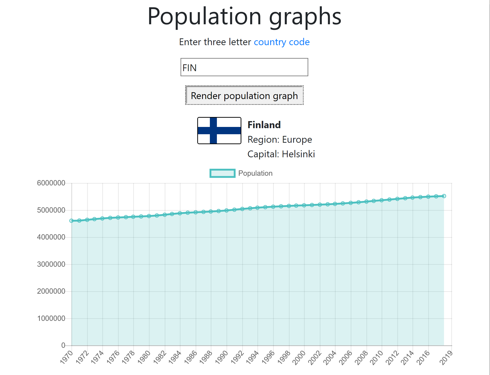

# Population graphs
Simple app to visualize World Bank population data.

## How to install
Nothing needed to install. This is a simple frontend using data from a REST API.

## How to run locally
Open the file index.html using a browser.

## How to edit code
Open the file index.html or myChart.js using an editing tool (e.g. Visual Studio Code).

## How it works
The frontend fetches data from a REST API serving World Bank open population data and visualizes it using Chart.js. The user enters the country code (as [ISO3 country code](https://en.wikipedia.org/wiki/ISO_3166-1_alpha-3)) for the country to visualize.

## Population data API
The rest API serves World Bank open data. The world bank API was not used directly due to its CORS policy preventing calls from locally viewed pages.

The REST API is currently running as a Google Cloud Function at https://europe-west1-world-bank-data.cloudfunctions.net/world-bank-fetcher.

The calls to the REST API are of the format https://europe-west1-world-bank-data.cloudfunctions.net/world-bank-fetcher/country/:countryCode/indicator/:indicatorCode

Example call to fetch population data of Finland: https://europe-west1-world-bank-data.cloudfunctions.net/world-bank-fetcher/country/FIN/indicator/SP.POP.TOTL

## Data
Data from the World Bank (CC BY 4.0). See https://datahelpdesk.worldbank.org/knowledgebase/topics/125589.
